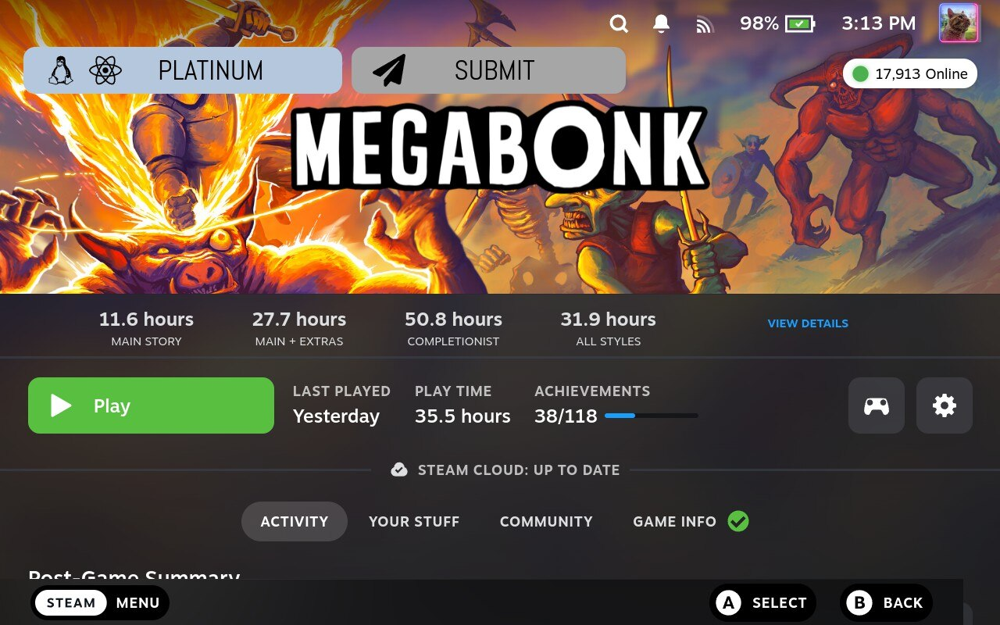

# ProtonDB Badges 🎮

[](https://github.com/bschelst/protondb-decky/releases)
[](LICENSE)
[](https://github.com/SteamDeckHomebrew/decky-loader)

Display **tappable ProtonDB badges** directly on your Steam library game pages / Store pages.


 Library view:



 Store view:


---

## ⚙️ What it does

ProtonDB Badges retrieves ProtonDB ratings via the ProtonDB API and overlays them as a tappable badge on each game's library page. Tapping the badge opens the corresponding ProtonDB page.

This plugin is an actively maintained extension of the original *protondb-decky* plugin and adds a **Submit** button, allowing users to submit ProtonDB reports **directly from Game Mode**, from their library, without opening a browser.  
The submit button can be enabled or disabled in the plugin settings.

---

## ✨ Why this plugin exists

The original protondb-decky plugin is no longer maintained and has been archived. Additionally, submitting ProtonDB reports required several manual steps outside Game Mode.

This plugin was created to:
- Keep ProtonDB badges available on Steam Deck/Steam Client Picture Big mode.
- Simplify report submission.
- Allow submission to be done directly from the game page in Game Mode.
- Show badge on Steam Store page. (only on Steam Deck)

---

## 🛠️ Features & Options

- **Badge size**: Regular, Small, or Minimalist (icon-only)
- **Badge position**: Multiple positions around the game header. (Hero)
- **Submit button toggle**: Disable report submission if desired.
- **Library badge button toggle**: Disable the badges in library.
- **Store badge button toggle**: Disable the badge in Steam store pages.


---

## 📊 Compatibility Analysis

The analysis button (bar chart icon) next to the ProtonDB badge opens a detailed compatibility breakdown powered by community reports. The button color indicates the current working status:

- **Green** — Game is working based on recent reports
- **Red** — Game is not working or has significant issues
- **Gray** — Not enough data to determine status

> Note: These colors reflect whether the game works *right now*, which is different from the ProtonDB tier (Platinum/Gold/Silver/Bronze/Borked) that rates *how well* it runs.

### Tabs

| Tab | Description |
|-----|-------------|
| **Details** | Working status, confidence score, trend direction, freshness, and warnings |
| **Reports** | Report history chart (last 5 years) showing good vs bad reports per month, followed by the 20 most recent individual reports |
| **Versions** | Proton version breakdown — report counts and success rates per version. The current Steam Deck default is highlighted |
| **Settings** | Launch options extracted from positive community reports. Tap **Copy** to copy an option to clipboard, then paste it into Steam > Game Properties > Launch Options before `%command%` |

### Library Status Icons

Small status icons appear on game covers in the library grid:

- **Green atom** — Game should work on Linux
- **Red atom** — Game is borked or not working
- **Gray atom** — Unknown or insufficient data

These icons are populated in the background after plugin startup. Games you haven't browsed yet may take a few minutes to appear as data is fetched in batches to avoid API overload.

### Settings Tips

The Settings tab shows environment variables that other users have successfully used when running the game. Only options from positive reports (Platinum/Gold/Silver) are included, and each option must appear in at least 2 reports.

Example usage:
```
PROTON_ENABLE_NVAPI=1 %command%
```

---

## ⚠️ Limitations

**ProtonDB device registration**  
The first time you want to submit a report on Steam Deck, you will need to open the protondb website in desktop mode in order to register the Steam Deck.
This is a limitation of the protondb website, and this is only a one-time action.

**Steam Store page ProtonDB badges**  
- Currently the badges are visible as an overlay, which doesn't look the same as the badges on the library.
- It's currently not possible to click on the badge using an external controller.
- Protondb badges are not available in store pages on Linux/Bazitte, and will currently only work on Steam Deck. (I need to check the possibities to make it available on Bazitte too)

---

## 🌍 Translations

Some translations were added or updated using AI, as I don't know yet how Crowdine works.'   This is only temporary.
If you spot an incorrect or awkward translation, pull requests are welcome.

---

## 🧪 Compatibility & Testing

Tested on:
- **SteamOS 3.9** — Steam Deck LCD - Decky Loader v3.2.1 — SteamClient023
- **Ubuntu 25.10** — Steam Big Picture Mode - Decky Loader v3.2.1 — SteamClient023
- **Bazzite 43 (NVIDIA)** - Steam Big Picture Mode - Decky Loader v3.2.1 — SteamClient023

Steam Deck OLED has not been tested yet, because I don't own a Steam Deck OLED. Feel free to send me one.

---

## 💖 Sponsoring

If you find this plugin useful and want to support its continued development, you can sponsor me.

Your support helps with:
- Maintenance and bug fixes  
- New features and improvements  
- Ability to develop new plugins  

### ❤️ Support the project

- 🐙 **GitHub Sponsors**  
  https://github.com/sponsors/bschelst
- ☕ **Ko-fi**  
  https://ko-fi.com/bschelst
- ☕ **Buy Me a Coffee**  
  https://www.buymeacoffee.com/bschelst

---

## 🧩 Requirements

- Steam Deck or Linux PC using Steam Big Picture
- Decky Loader installed


Decky Loader:  
https://github.com/SteamDeckHomebrew/decky-loader

---

## 📦 Installation (Decky Loader)

Use Decky Store, search for ProtonDB badges or use manual instructions below:

1. Download the **latest `.zip` release**:
   https://github.com/bschelst/protondb-decky/releases

2. Open **Game Mode** and launch **Decky Loader**.

3. Enable developer mode in Decky Loader if not enabled yet.

4. Go to **Decky Settings → Plugins → Install from ZIP**.

5. Select the downloaded `protondb-decky-<version>.zip`.

6. Restart steam client.

The badges will appear automatically on supported games in your library.

### 🔄 Updating

To update, install the latest ZIP via Decky Loader.  
Existing settings are preserved.
